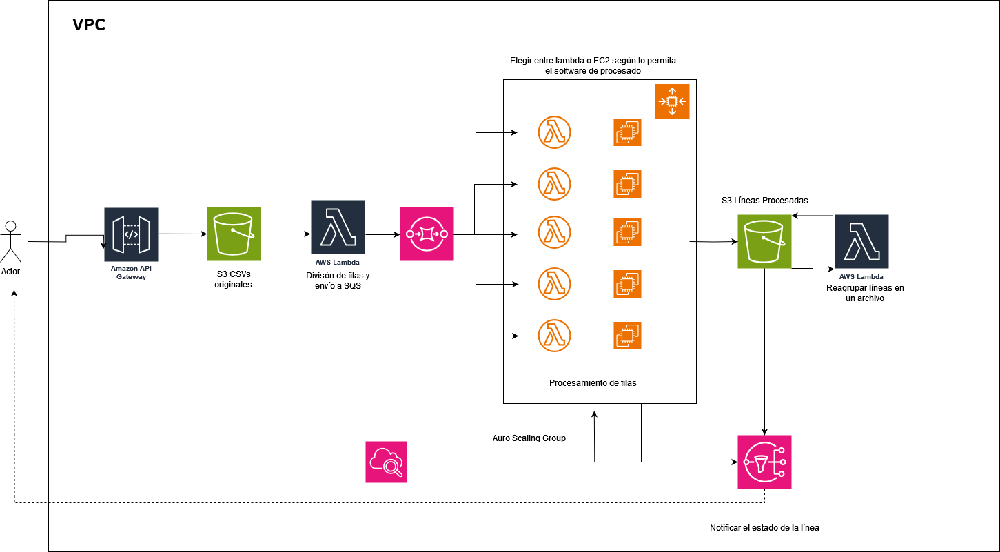

### Ejercicio 2

##Caracterísiticas a mencionar:
* El cliente quiere ver el estado de proceso del archivo en cualquier momento
* Se han de limitar las subidas que puede hacer uun usuario
* Se debe utilizar el software de la empresa A 
* Ser consciente de los costes (No se pueden tener infinitas máquinas)

## Elementos a utilizar: 
 
* SQS
* S3
* Lambda
* SNS
* Cloudwatch
* API Gateway
* EC2 (opcional)
* IAM 
  * Administrador: Cambiar configuración de la infraestructura
  * Lector: Puede ver el contenido de los S3
  * Analista: Puede ver el dashboard de cloudwatch para monitorizar y asesorar al administrador para cambiar la configuuración

## Explicación: 

1. Los archivos csv y excel de local se suben a un S3 Bucket mediante una API Gateway desde 
2. Los excel son divididos en filas mediante una función lambda que los reparte en un SQS.
3. Los SQS se reparten entre las lambdas o EC2 disponibles
4. Las Lambdas y EC2 están en un Auto Scaling Group para que puedan prestar servicio según la demanda de trabajo. 
   * [Lambda Auto Scaling](https://aws.amazon.com/es/blogs/compute/understanding-how-aws-lambda-scales-when-subscribed-to-amazon-sqs-queues/)
5. Los resultados de las lambdas se guardan en un S3 con los resltados del CSV original, asimismo, se envía una notificación mediante SNS para indicar que esa fila ha sido procesada y podrá acceder al resultado de la misma
   * Opcionalmente se pueden reagrupar las líneas procesadas en un mismo archivo con otra lambda function cuando estén todas las líneas procesadas. 
6. Por último, es recomendable monitorizar la parte de procesamiento mediante Cloudwatch para ver picos de demanda para ajustar los valores del autoescalado.

Diagrama:

